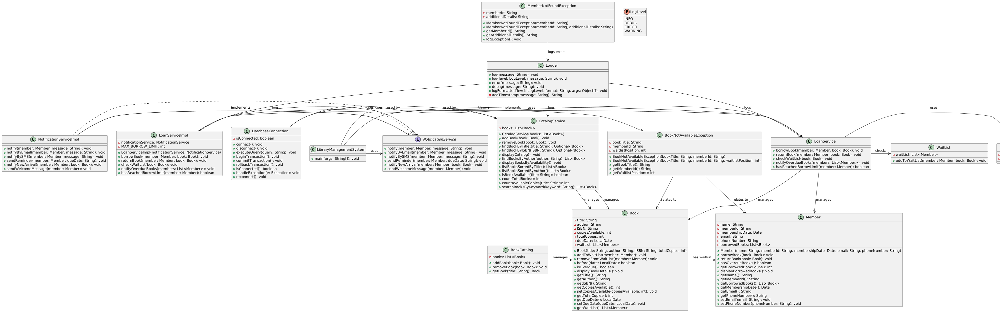

# Library Management System
## Project Overview
The Library Management System is a Java-based application designed to manage books, members, borrow/return operations, and notifications in a library setting. This project demonstrates the use of SOLID principles, offering a clean, scalable, and extensible design. The system allows efficient management of the book catalog, membership details, loan tracking, and sends notifications to members for due dates, new arrivals, and overdue books.
## Key Features:
Book Catalog Management: Manage a collection of books, including adding, removing, searching, and sorting books by title, author, and ISBN.
Membership Management: Handle member registrations, track borrowed books, and enforce borrowing limits.
Borrowing and Returning Books: Allow members to borrow books and return them after a specified due date. The system tracks overdue books and handles penalties (if applicable).
Waitlist Management: If a book is unavailable, members can be placed on a waitlist to be notified once the book becomes available.
Notification System: The system sends notifications to members via email or SMS, including overdue reminders and new book arrivals.
## Project Structure
```plaintext
library-management-system/
├── core/
│   ├── Book.java
│   ├── Member.java
│   ├── CatalogService.java
│   ├── LoanService.java
│   ├── NotificationService.java
│   ├── NotificationServiceImpl.java
│   ├── WaitList.java
│   └── DatabaseConnection.java
├── service/
│   ├── LoanServiceImpl.java
│   ├── CatalogServiceImpl.java
│   ├── NotificationServiceImpl.java
│   └── Logger.java
└── exceptions/
    ├── BookNotAvailableException.java
    └── MemberNotFoundException.java
```
## Core Components
Book.java: The Book class represents the properties of a book, including its title, author, ISBN, availability, due date, and the waitlist for borrowing.
Member.java: The Member class holds the details of a library member, including personal information, borrowed books, and membership status.
CatalogService.java: Provides services for adding, removing, and searching books within the library's catalog.
LoanService.java: Responsible for processing book loans, managing borrowed books, and ensuring that no member exceeds the borrowing limit.
NotificationService.java: An interface that defines methods for notifying members via different channels (email, SMS, reminders).
NotificationServiceImpl.java: Implements the NotificationService interface to send notifications for events like overdue books or new arrivals.
WaitList.java: Manages a waitlist for books that are currently unavailable, allowing members to be notified when a book is available.
DatabaseConnection.java: Handles database operations, including connecting, querying, and executing transactions.
## Service Layer
LoanServiceImpl.java: Implements the loan service logic, ensuring that the book borrowing process adheres to business rules such as checking availability and handling overdue books.
CatalogServiceImpl.java: Implements the catalog service, allowing users to add, remove, and search books in the catalog.
NotificationServiceImpl.java: Implements the logic to notify members about overdue books, new arrivals, and reminders via email or SMS.
Logger.java: A logging utility that records events in the system, helping to track operations and errors.
## Exception Handling
BookNotAvailableException.java: This exception is thrown when a book is not available for borrowing, either due to being already borrowed or unavailable in the library.
MemberNotFoundException.java: This exception is thrown when an action is attempted with a member ID that does not exist in the system.
## UML Diagram
The project's architecture is illustrated in the UML diagram below, which provides a visual representation of the relationships between the classes and interfaces. This diagram helps in understanding the design and structure of the system.

## Application of SOLID Principles
Single Responsibility Principle (SRP):
Each class in the project is designed to have a single responsibility. For instance, the Book class focuses on managing book-specific information, like title, author, and availability, while the LoanService class manages the process of borrowing and returning books. This separation of concerns ensures that each class only has one reason to change, making the code easier to understand and maintain.

Open/Closed Principle (OCP):
The NotificationService interface is designed to be open for extension but closed for modification. For example, new notification types like SMS and Email can be added by implementing NotificationService without altering the existing interface or code, allowing for future flexibility without risking the stability of existing features.

Liskov Substitution Principle (LSP):
The NotificationServiceImpl class and other service implementations adhere to LSP by allowing any NotificationService implementation to be used interchangeably. Similarly, the system enables LoanServiceImpl and other service classes to be substituted based on the interface they implement, ensuring the behavior is consistent and correct.

Interface Segregation Principle (ISP):
The project applies ISP by defining focused interfaces that each serve a single purpose:

NotificationService: Defines methods specifically for sending notifications.
LoanService: Contains methods focused on the process of loaning books.
CatalogService: Provides methods specific to catalog management.
This structure prevents clients from depending on methods they do not use, keeping the code modular and easy to extend.

Dependency Inversion Principle (DIP):
The project leverages DIP by relying on abstractions rather than concrete classes. For example:

LoanServiceImpl implements the LoanService interface, allowing the system to depend on the abstraction rather than the specific implementation.
NotificationServiceImpl implements NotificationService, making it easy to replace or extend notification methods without altering dependent classes.
This approach promotes flexibility and makes the system adaptable to new service implementations while keeping dependencies minimal and decoupled.
